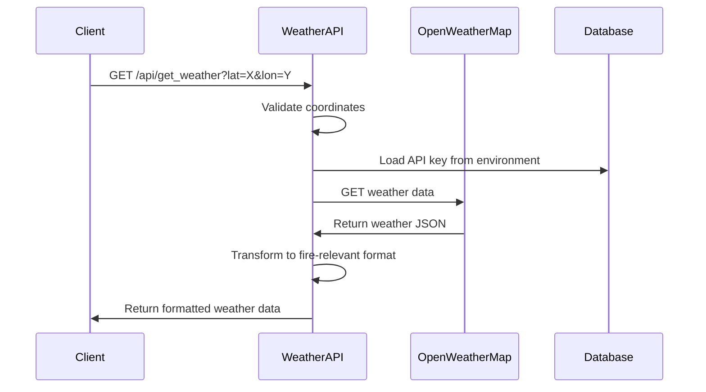

# Weather API Documentation

## Overview
The Weather API is a Flask-based RESTful service designed to provide fire-relevant weather data by integrating with the OpenWeatherMap API. This service is part of a larger fire prediction and monitoring system.
---

## API Endpoints

### 1. Get Weather Data
**Endpoint:** `GET /api/get_weather`

**Description:** Retrieves current weather data for specified coordinates, formatted for fire risk assessment.

**Parameters:**
- `lat` (required): Latitude coordinate (float, -90 to 90)
- `lon` (required): Longitude coordinate (float, -180 to 180)

**Example Request:**
```http
GET /api/get_weather?lat=37.7749&lon=-122.4194
```

**Example Response:**
```json
{
  "location": {
    "lat": "37.7749",
    "lon": "-122.4194",
    "name": "San Francisco"
  },
  "weather": {
    "temperature": 18.5,
    "humidity": 65,
    "wind_speed": 3.2,
    "wind_direction": 270,
    "precipitation": 0,
    "conditions": "Clear",
    "description": "clear sky"
  },
  "timestamp": 1635724800
}
```

**Status Codes:**
- `200 OK`: Successful response
- `400 Bad Request`: Missing or invalid parameters
- `500 Internal Server Error`: API key not configured or external API error

### 2. Fire Prediction (Placeholder)
**Endpoint:** `POST /api/predict` *(Not implemented)*

**Description:** Reserved endpoint for fire prediction functionality using weather and environmental data.

---

## Technical Design

### System Architecture

```
┌─────────────────┐    ┌─────────────────┐    ┌─────────────────┐
│   Frontend      │    │  Weather API    │    │ OpenWeatherMap  │
│   Application   │◄──►│   (Flask)       │◄──►│      API        │
└─────────────────┘    └─────────────────┘    └─────────────────┘
         │                       │                       
         │                       │                       
         ▼                       ▼                       
┌─────────────────┐    ┌─────────────────┐              
│    Database     │    │   JWT Auth      │              
│   (Settings)    │    │   Service       │              
└─────────────────┘    └─────────────────┘              
```

### Technology Stack

**Backend Framework:**
- Flask (Python web framework)
- Flask-RESTful (REST API extension)
- Python Requests (HTTP client)

**Authentication:**
- JWT (JSON Web Tokens) for API security
- Custom `@token_required` decorator

**Configuration:**
- Python-dotenv for environment variable management
- OS environment variables for API keys

**External Dependencies:**
- OpenWeatherMap API for weather data

---

## Architecture Components

### 1. Frontend
**Purpose:** User interface for interacting with weather data and fire predictions

**Technologies:**
- Web-based interface (framework not specified)
- Makes HTTP requests to Weather API endpoints
- Displays weather data and fire risk assessments

**Integration Points:**
- Calls `/api/get_weather` with latitude/longitude coordinates
- Future integration with `/api/predict` for fire predictions

### 2. APIs

#### Weather API Service
**File:** `weather_api.py`
**Components:**
- Flask Blueprint for modular routing
- RESTful resource classes using Flask-RESTful
- Environment-based configuration

**Key Classes:**
```python
class WeatherApi:
    class _WEATHER(Resource):
        def get(self): # Handles weather data requests
    
    class _PREDICT(Resource):
        pass  # Placeholder for fire prediction
```

#### External API Integration
**Service:** OpenWeatherMap API
- **Endpoint:** `https://api.openweathermap.org/data/2.5/weather`
- **Authentication:** API Key
- **Response Format:** JSON
- **Rate Limits:** Depends on subscription plan

### 3. Model Layer

#### Settings Model
**File:** `model/usettings.py`
**Purpose:** Database model for user settings and configuration
**Usage:** Potentially stores user preferences, API configurations

#### Data Models
**Weather Data Structure:**
```python
fire_relevant_data = {
    "location": {
        "lat": float,
        "lon": float, 
        "name": str
    },
    "weather": {
        "temperature": float,      # Celsius
        "humidity": int,           # Percentage
        "wind_speed": float,       # m/s
        "wind_direction": int,     # Degrees
        "precipitation": float,    # mm/hour
        "conditions": str,         # Main weather condition
        "description": str         # Detailed description
    },
    "timestamp": int              # Unix timestamp
}
```

### 4. ML/Prediction System (Future Implementation)

**Planned Components:**
- Fire risk prediction model
- Integration with weather data
- Historical data analysis
- Risk scoring algorithms

**Potential Features:**
- Machine learning models for fire probability
- Time series analysis of weather patterns
- Risk factor weighting (temperature, humidity, wind, precipitation)
- Geographic risk assessment

---

## Data Flow

### Weather Data Request Flow



### Data Transformation Process

1. **Input Validation:**
   - Check for required lat/lon parameters
   - Validate coordinate ranges

2. **External API Call:**
   - Construct OpenWeatherMap request
   - Include API key and metric units
   - Handle API response

3. **Data Processing:**
   - Extract fire-relevant metrics
   - Format response structure
   - Add location metadata

4. **Response Delivery:**
   - Return JSON formatted data
   - Include appropriate HTTP status codes

---

## Error Handling

### Error Response Format
```json
{
  "error": "Error Type",
  "message": "Detailed error description"
}
```

### Common Error Scenarios

| Error Type | Status Code | Cause | Solution |
|------------|-------------|-------|----------|
| Missing Parameters | 400 | lat/lon not provided | Include required coordinates |
| API Key Missing | 500 | WEATHER_API_KEY not set | Configure environment variable |
| External API Error | varies | OpenWeatherMap API issues | Check API key, rate limits |
| Server Error | 500 | Unexpected exceptions | Check logs, validate input |

---

## Setup and Configuration

### Environment Variables
```bash
# Required
WEATHER_API_KEY=your_openweathermap_api_key

# Optional
FLASK_ENV=development
FLASK_DEBUG=True
```

### Installation Requirements
```txt
Flask>=2.0.0
Flask-RESTful>=0.3.9
python-dotenv>=0.19.0
requests>=2.25.0
```

### Deployment Checklist
- [ ] Set WEATHER_API_KEY environment variable
- [ ] Configure database connection
- [ ] Set up JWT authentication
- [ ] Configure logging
- [ ] Set up monitoring and health checks

---

## Code Examples

### Basic Usage
```python
import requests

# Make weather request
response = requests.get(
    'http://localhost:5000/api/get_weather',
    params={
        'lat': 37.7749,
        'lon': -122.4194
    }
)

weather_data = response.json()
print(f"Temperature: {weather_data['weather']['temperature']}°C")
print(f"Humidity: {weather_data['weather']['humidity']}%")
```

### Error Handling Example
```python
import requests

def get_weather_data(lat, lon):
    try:
        response = requests.get(
            'http://localhost:5000/api/get_weather',
            params={'lat': lat, 'lon': lon},
            timeout=10
        )
        
        if response.status_code == 200:
            return response.json()
        elif response.status_code == 400:
            print("Invalid coordinates provided")
        elif response.status_code == 500:
            print("Server configuration error")
        else:
            print(f"Unexpected error: {response.status_code}")
            
    except requests.RequestException as e:
        print(f"Request failed: {e}")
    
    return None
```

### Fire Risk Assessment Example
```python
def assess_fire_risk(weather_data):
    """
    Basic fire risk assessment based on weather conditions
    """
    temp = weather_data['weather']['temperature']
    humidity = weather_data['weather']['humidity']
    wind_speed = weather_data['weather']['wind_speed']
    precipitation = weather_data['weather']['precipitation']
    
    risk_score = 0
    
    # Temperature risk (higher temp = higher risk)
    if temp > 30:
        risk_score += 3
    elif temp > 20:
        risk_score += 2
    elif temp > 10:
        risk_score += 1
    
    # Humidity risk (lower humidity = higher risk)
    if humidity < 30:
        risk_score += 3
    elif humidity < 50:
        risk_score += 2
    elif humidity < 70:
        risk_score += 1
    
    # Wind risk (higher wind = higher risk)
    if wind_speed > 10:
        risk_score += 3
    elif wind_speed > 5:
        risk_score += 2
    elif wind_speed > 2:
        risk_score += 1
    
    # Precipitation reduces risk
    if precipitation > 5:
        risk_score -= 2
    elif precipitation > 1:
        risk_score -= 1
    
    # Normalize score
    risk_score = max(0, min(10, risk_score))
    
    risk_levels = {
        0-2: "Low",
        3-5: "Moderate", 
        6-8: "High",
        9-10: "Extreme"
    }
    
    for range_key, level in risk_levels.items():
        if risk_score in range(range_key[0], range_key[1] + 1):
            return {
                "score": risk_score,
                "level": level,
                "weather": weather_data
            }
```

---

## Future Enhancements

### Planned Features
1. **Fire Prediction Model Integration**
   - Machine learning model deployment
   - Historical weather data analysis
   - Risk prediction algorithms

2. **Enhanced Weather Data**
   - 7-day weather forecasts
   - Historical weather trends
   - Extreme weather alerts

3. **API Improvements**
   - Rate limiting implementation
   - Caching for frequently requested locations
   - Batch processing for multiple coordinates

4. **Monitoring and Analytics**
   - API usage metrics
   - Performance monitoring
   - Error rate tracking

